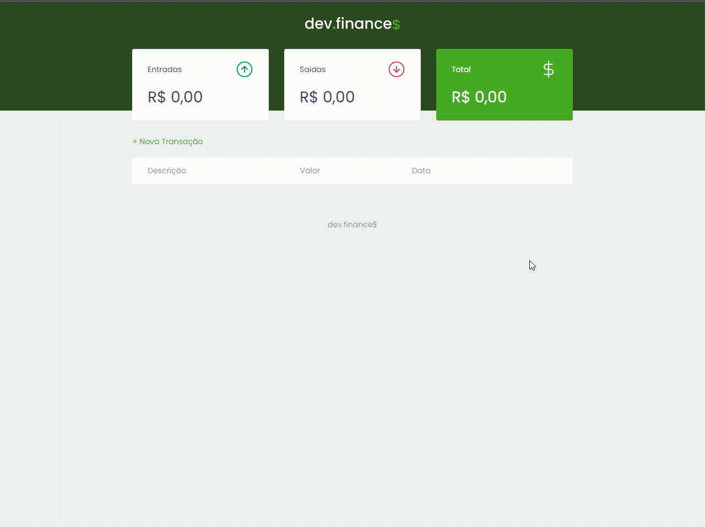

<h1 align="center">
 
    
 
 
</h1>

##

    

##

    <a href="#-features">Features</a>&nbsp;&nbsp;&nbsp;|&nbsp;&nbsp;&nbsp;
    <a href="#-technologies">Technologies</a>&nbsp;&nbsp;&nbsp;|&nbsp;&nbsp;&nbsp;
    <a href="#-deploy">Deploy</a>&nbsp;&nbsp;&nbsp;|&nbsp;&nbsp;&nbsp;
    <a href="#-getting-started">Getting Started</a>&nbsp;&nbsp;&nbsp;|&nbsp;&nbsp;&nbsp;
    <a href="#-contributing">Contributing</a>&nbsp;&nbsp;&nbsp;|&nbsp;&nbsp;&nbsp;
    <a href="#memo-license">License</a>

 O dev.finances é uma aplicação para controle de finanças.  
Na aplicação você consegue registrar transações, deletar transações e ver o balanço total das entradas e saídas da sua conta.

    

## 📈 Features
<!-- ❌✅ -->&nbsp;&nbsp;&nbsp;
1. ✅ Registro de Entradas;
2. ✅ Registro de Saídas;
3. ✅ Cálculo do Total;
4. ✅ Adicionar transação;
5. ✅ Remover transação;
6. ✅ Tabela com os campos: 
&nbsp;&nbsp;&nbsp;&nbsp;&nbsp;&nbsp;&nbsp;&nbsp;&nbsp;✅ Descrição; 
&nbsp;&nbsp;&nbsp;&nbsp;&nbsp;&nbsp;&nbsp;&nbsp;&nbsp;✅ Valor; 
&nbsp;&nbsp;&nbsp;&nbsp;&nbsp;&nbsp;&nbsp;&nbsp;&nbsp;✅ Data. 
7. ✅ Modal: 
&nbsp;&nbsp;&nbsp;&nbsp;&nbsp;&nbsp;&nbsp;&nbsp;&nbsp;✅ Salvar transação; 
&nbsp;&nbsp;&nbsp;&nbsp;&nbsp;&nbsp;&nbsp;&nbsp;&nbsp;✅ Cancelar ação. 
8. ❌ Responsividade para mobile e desktop.

## 🛠 Technologies

- **HTML;**
- **CSS;**
- **Javascript.**

## 🚀 Deploy

 - Veja o projeto sendo executado <a href="https://rafaeljurkfitz.github.io/dev-finances/">aqui</a>.

## 💻 Getting started

 - Clone esse repositório apenas usando: `git clone https://github.com/rafaeljurkfitz/dev-finances.git`

## 🤝 Contributing

Contributions are what make the open source community such an amazing place to be learn, inspire, and create. Any contributions you make are **greatly appreciated**.

1. Fork the Project
2. Create your Feature Branch (`git checkout -b feature/AmazingFeature`)
3. Commit your Changes (`git commit -m 'Add some AmazingFeature'`)
4. Push to the Branch (`git push origin feature/AmazingFeature`)
5. Open a Pull Request

## :memo: License

This project is licensed under the MIT License - see the [LICENSE](https://opensource.org/licenses/MIT) page for details.

